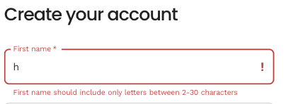

# Circulate8 extracts

## Introduction

This is a compilation of some of my work as a front-end developer at [Circulate8](https://www.circulate8.com/). I was fortunate to work alongside, and be inspired by two senior full-stack developers. The design and wireframes were created by the team's gifted UI designer. My responsibility was to create performant, reusable React components, implement new features, testing, and general maintenance. 

## Technologies used

-   [Next.js](https://nextjs.org/) on a [Swell.is](https://www.swell.is/) platform
-   [Material UI](https://mui.com/)
-   [Format.js](https://formatjs.io/)
-   [Cypress](https://www.cypress.io/)

## Examples of features I developed

-   [Create account](#create-account)
-   [User account page](#user-account-page)
-   [Components](#components)

    -   [Breadcrumbs](#breadcrumbs)
    -   [BackgroundImage](#backgroundimage)
    -   [FilterChips and NullResult](#filterchips-and-nullresult)
    -   Dialog and AddToCartDialog
    -   SustainabilityImage/LabelImage
    -   ProductSustainabilityLabel and Tooltip

-   [Testing](#testing)

## Create account

### Pre-requisites

Material UI theming and components for faster development and consistency in design according to wireframes. 
By creating an account, the user can facilitate re-orders and enjoy a faster checkout process by saving their account data. The user creates an account by filling out a form. On successfully submitting the form the user is automatically logged in and redirected to the landing page.

### Process and lessons learned

I had the choice to use the built-in client form validation, but in order to follow design, and to achieve a greater user experience I decided to build a custom one. This enables customizable, informative error messages, and greater accessibility by connecting field to error and informing the user of what error occurred and how to correct it ([read more on form error WCAG violations](https://cloudfour.com/thinks/progressively-enhanced-form-validation-part-1-html-and-css/?utm_source=CSS-Weekly&utm_campaign=Issue-557&utm_medium=email)). 
 
For validation, I created a custom hook (formControls), and validated _onBlur_ to facilitate the user to know what user data was expected as the form was filled out. My ambition was that this hook could then be reused for all forms across the application. In retrospect I would today refactor the hook with useReducer for readability. 

### Current status and later additions by colleagues

Tracking, and affiliation added. 
[View feature on Circulate8 website](https://www.circulate8.com/buyer/signup#create-account)

## User account page

### Pre-requisites

Material UI theming and components for fast development and consistency in design according to wireframes. 
The user should be able to view, create, update or delete their contact details, password, and credit cards, and view previous orders.

### Process and lessons learned

For this feature, I reused much of the formControls hook and implementation for the [Create account](#create-account) feature. To control the state of 'new', 'edit', or 'delete' addresses I implemented a useReducer hook, and checked for previously saved addresses, as initial state, to prefill. 
The user is notified when details successfully changed by an alert. If user initiate an update of data but thereafter click outside of form area the alert prompt the user to save or discard changes. 
The payment details tab follow previously described user flow and additionally presents an overview of order history to facilitate reorders.

### Current status and later additions

Feature to set account as billing or shipping implemented, tokenise creditcard. 
[View feature on Circulate8 website](https://www.circulate8.com/buyer/signup#login) by first creating a free account followed by visiting the user account page.

## Components

### Breadcrumbs

When developing this feature I learned much about Next.js useRouter, working with queries, and complex logic for when to show parent category, leaf category and/or product as crumbs. In retrospect I think this implementation is a good candidate to be refactored with the useReducer hook for readability and performance instead of recurrent if/else. 
Later additions are custom separator, add empty breadcrumb on landing page, removal of category when multiple subcategories are selected, and refactoring to use simpler logic.

### BackgroundImage

The Next.js `<Image/>` component is optimised for performance, and used heavily across the entire web application. However I found the need to reduce repetitive code for background images and created a component that could be modified depending if the background image should be a fullwidth image or contained in width.

### FilterChips and NullResult

Visually enhance applied filter settings by customizing MUI chip component and render in filter component as user filters products and categories. When two filters are selected a _Clear All Filters_ action button is displayed. 
 
The NullResult component uses the query to keep track of applied filters and count expected search results by removing any one of the applied filters.

## Testing

With no previous experience of Cypress and test automation, I configured and developed the first initial smoke tests and e2e tests for Circulate8. I found the initial tests to be very flaky. By reading the documentation, refactoring and troubleshooting I eventually created more robust tests and could more easily derive errors to bugs and not a flaky test. By using data-attributes, to find elements, I separate testing attributes from others to reduce risk of potential removal when refactoring or altering code base. 
I learned many things about network requests and preflights, how some elements can be hidden and unable to be interacted with by Cypress due to the stacking context, and I highly enjoyed the troubleshooting involved in test-automation.
